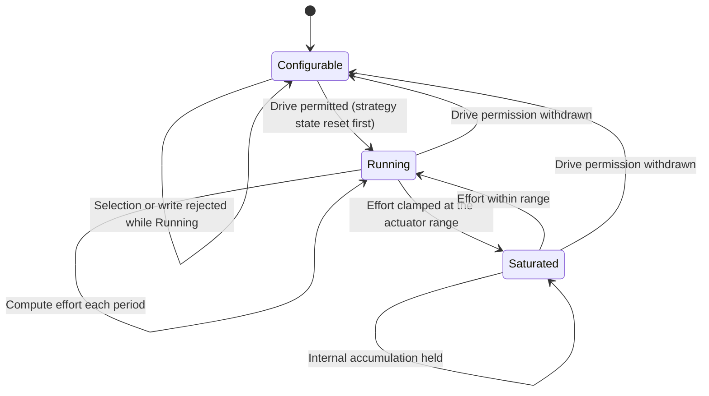
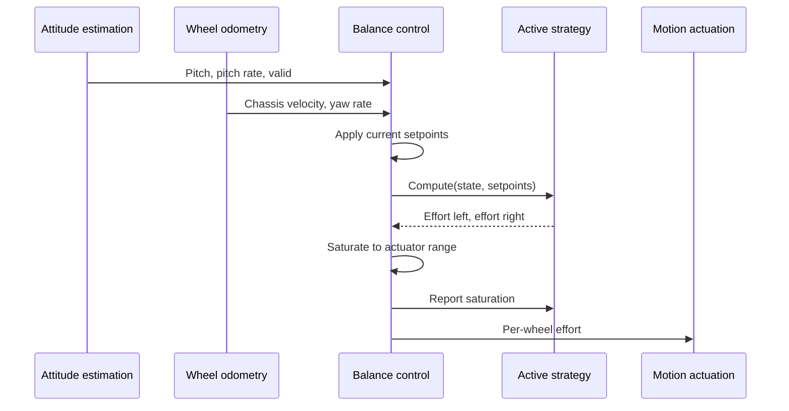
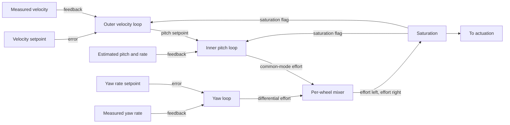

| Field     | Value                  |
|-----------|------------------------|
| Title     | Balance Control Design |
| Type      | design                 |
| Status    | draft                  |
| Version   | 0.1.0                  |
| Component | balance-control        |
| Date      | 2026-09-16             |

> **The control law is a runtime choice, not an architectural commitment.** This document
> designs the seam that makes that true: one strategy interface, several interchangeable
> implementations, and a selection mechanism confined to a state where swapping is safe.

---

## Responsibilities

**Is responsible for:**
- Defining the single interface every control strategy implements.
- Converting the estimated state and the operator setpoints into a per-wheel effort command.
- Hosting the available strategies and tracking which one is active.
- Publishing each strategy's tunable parameter set in a self-describing form, so a client
  can tune a strategy it has no built-in knowledge of.
- Enforcing that a strategy change or a parameter write happens only while not ARMED.
- Resetting the active strategy's internal state on every transition into ARMED.
- Saturating the effort command and preventing internal state from growing while saturated.

**Is NOT responsible for:**
- Estimating attitude or wheel motion — it consumes both.
- Deciding whether the drive may be energised — the safety supervisor owns that.
- Mapping effort onto bridge duty cycle and direction — that is motion actuation.
- Transporting parameters over the link — connectivity carries them; this component
  defines what they mean and validates them.
- Persisting parameters — it supplies and accepts values; the platform stores them.

---

## Component Details

### Part A — The strategy interface

Every strategy is a pure function of state plus memory: it receives the estimated pitch and
pitch rate, the measured chassis velocity and yaw rate, and the commanded velocity and yaw
setpoints; it returns a signed effort for each wheel. Alongside that it offers three
lifecycle operations — reset its internal state, describe its parameters, and get or set a
parameter by index.

The interface is deliberately narrow. Nothing in it mentions gains, error terms, state
vectors or matrices, because those are properties of particular laws. This is what allows
the requirements to be written as outcomes and to be satisfied by any conforming strategy.

### Part B — Cascaded PID strategy

An outer loop compares commanded and measured chassis velocity and produces a *pitch
setpoint* — to go faster, lean further forward. An inner loop drives the estimated pitch to
that setpoint and produces a common-mode effort. A third loop drives yaw rate to its
setpoint and produces a differential effort. The two are summed per wheel.

The nesting is what makes it work: the inner loop must be substantially faster than the
outer, or the robot chases a pitch target that is still moving. Its parameters are the
proportional, integral and derivative terms of the three loops.

### Part C — Full-state feedback (LQR) strategy

A single gain vector maps the deviation of the state — pitch, pitch rate, wheel position,
wheel velocity — onto a common-mode effort, with a separate yaw term for the differential
part. The gains come from solving the linearised regulator problem offline; the firmware
evaluates one inner product per iteration. Its parameters are the elements of that gain
vector, which is why the parameter descriptor must be per-strategy rather than a fixed
layout of named gains.

### Part D — Strategy registry and selection

The registry holds the compiled-in strategies, exposes their identifiers, and tracks the
active one. Selection is refused while ARMED. This is not a convenience restriction: the
strategies have different internal state, and swapping mid-flight would apply a
freshly-reset controller to a robot already in motion. Refusal is silent to the drive — the
running controller is not disturbed by a rejected request.

### Part E — Setpoint arbitration and saturation

Setpoints reach the controller from the operator, but the controller does not trust them
unconditionally. They are range-checked, decayed to zero on operator silence or link loss,
and forced to zero whenever the system is not ARMED. Effort is clamped to the actuator
range on output, and the active strategy is told that it saturated so that any accumulating
internal term stops growing — otherwise a robot held against a wall builds up a correction
it discharges violently on release.

---

## Interfaces

### Provided

| Interface            | Purpose                                                  | Contract                                                                                                          |
|----------------------|----------------------------------------------------------|-------------------------------------------------------------------------------------------------------------------|
| Control strategy     | The common interface every law implements                | Consumes estimated state and setpoints, produces per-wheel effort; bounded execution, no allocation, no recursion |
| Effort command       | Per-wheel signed effort for actuation                    | Within the configured actuator range; zero whenever not ARMED                                                     |
| Strategy registry    | Enumerate available strategies and report the active one | At least two strategies available; identifiers stable across builds                                               |
| Strategy selection   | Change the active strategy                               | Accepted only while not ARMED; a rejected request leaves the active strategy and its state untouched              |
| Parameter descriptor | Describe the active strategy's tunable parameters        | Reports count, order, identity and permitted range; changes when the active strategy changes                      |
| Parameter access     | Read and write parameters by index                       | Writes accepted only while not ARMED; out-of-range values rejected with the stored value unchanged                |
| Strategy lifecycle   | Reset the active strategy's internal state               | Called by the supervisor on every transition into ARMED; completes before the drive is permitted                  |

### Required

| Interface         | Purpose                                 | Contract                                                                |
|-------------------|-----------------------------------------|-------------------------------------------------------------------------|
| Attitude estimate | Pitch and pitch rate with validity      | An invalid estimate must not produce a non-zero effort                  |
| Chassis motion    | Measured forward velocity and yaw rate  | Updated at the control-loop rate                                        |
| Motion setpoints  | Commanded forward velocity and yaw rate | Already range-checked and decayed by connectivity; zero when not ARMED  |
| Drive permission  | Whether the drive may be energised      | Deasserted forces zero effort regardless of strategy output             |
| Timebase          | Loop period for rate-dependent terms    | Nominal period is known; actual jitter stays within the specified bound |

---

## Data Model

| Entity               | Field                   | Type / Unit                | Range                           | Notes                                           |
|----------------------|-------------------------|----------------------------|---------------------------------|-------------------------------------------------|
| Estimated state      | pitch                   | radians                    | -0.61 to 0.61                   | Beyond this the supervisor has already disarmed |
| Estimated state      | pitchRate               | radians per second         | -8.7 to 8.7                     | Bias-corrected                                  |
| Estimated state      | chassisVelocity         | metres per second          | -1.5 to 1.5                     | Derived from both wheels                        |
| Estimated state      | yawRate                 | radians per second         | -3.1 to 3.1                     | Derived from the wheel difference               |
| Setpoints            | velocitySetpoint        | metres per second          | -1.0 to 1.0                     | Decays to zero on operator silence              |
| Setpoints            | yawRateSetpoint         | radians per second         | -1.6 to 1.6                     | Decays to zero on operator silence              |
| Output               | effortLeft, effortRight | normalised effort          | -1.0 to 1.0                     | Mapped to duty and direction by actuation       |
| Parameter descriptor | index                   | count                      | 0 to parameterCount-1           | Position is the identity used over the link     |
| Parameter descriptor | minimum, maximum        | same unit as the parameter | strategy-defined                | Writes outside the range are rejected           |
| Registry             | activeStrategy          | identifier                 | one of the available strategies | Changeable only while not ARMED                 |

---

## State Machine

The controller's own lifecycle, driven entirely by the supervisor's drive permission.



---

## Sequence Diagrams

One balance iteration.



Selecting a different strategy, and being refused while flying.

```mermaid
sequenceDiagram
    participant Op as Operator
    participant Link as Connectivity
    participant Ctrl as Balance control
    participant Sup as Safety supervisor

    Op->>Link: Select strategy B
    Link->>Ctrl: Selection request
    Ctrl->>Sup: Query mode
    Sup-->>Ctrl: IDLE
    Ctrl->>Ctrl: Activate strategy B
    Ctrl-->>Link: Accepted, descriptor changed
    Link-->>Op: New parameter descriptor

    Note over Op,Sup: Later, while balancing
    Op->>Link: Select strategy A
    Link->>Ctrl: Selection request
    Ctrl->>Sup: Query mode
    Sup-->>Ctrl: ARMED
    Ctrl-->>Link: Rejected
    Note over Ctrl: Strategy B keeps running, undisturbed
```

---

## Block Diagram

The cascade, drawn for the PID strategy. A full-state strategy replaces the two nested
blocks with a single gain block; everything outside the dashed boundary is unchanged.



---

## Constraints & Limitations

| Constraint             | Value / Description                                                                                                                                                                                                                         |
|------------------------|---------------------------------------------------------------------------------------------------------------------------------------------------------------------------------------------------------------------------------------------|
| Iteration budget       | The complete iteration — read state, dispatch to the strategy, saturate, publish effort — fits within the 500 Hz period and the 3 ms sensor-to-actuator latency                                                                             |
| Strategy dispatch      | One indirect call per iteration, in task context. Not reachable from an interrupt handler, so the project's prohibition on virtual dispatch in interrupt paths is not engaged. The cost is fixed once ARMED because selection cannot change |
| Memory                 | Strategies are constructed once at startup. No allocation on the control path; the registry has a compile-time fixed capacity                                                                                                               |
| Inner-outer separation | The cascade assumes the inner pitch loop is materially faster than the outer velocity loop; violating that produces a slow instability rather than an obvious failure                                                                       |
| Small-angle validity   | Strategies are tuned against a model linearised about upright; behaviour degrades as the body approaches the fall threshold                                                                                                                 |
| Level ground           | No slope compensation. On an incline the robot holds a pitch offset and drifts unless the operator commands against it                                                                                                                      |
| Parameter identity     | Parameters are addressed by index, not by name, to keep the link payload bounded. Reordering a strategy's parameters is a breaking change for stored values                                                                                 |

---

## Open Questions

| # | Question                                                                                                         | Options                                                                      | Status |
|---|------------------------------------------------------------------------------------------------------------------|------------------------------------------------------------------------------|--------|
| 1 | Which strategy is the factory default?                                                                           | Cascaded PID; LQR                                                            | open   |
| 2 | Should stored parameters be invalidated when a strategy's descriptor changes between firmware versions?          | Version the descriptor and reject stale values; always fall back to defaults | open   |
| 3 | Should the outer velocity loop limit the pitch setpoint it may request, independently of effort saturation?      | Rely on effort saturation; add an explicit pitch setpoint clamp              | open   |
| 4 | Should a third strategy exist for bench testing, commanding zero effort while reporting what it would have done? | Not needed; add an observing strategy                                        | open   |
| 5 | How is the yaw term handled by a full-state strategy — inside the gain vector or as a separate loop?             | Separate yaw loop for both strategies; per-strategy choice                   | open   |
