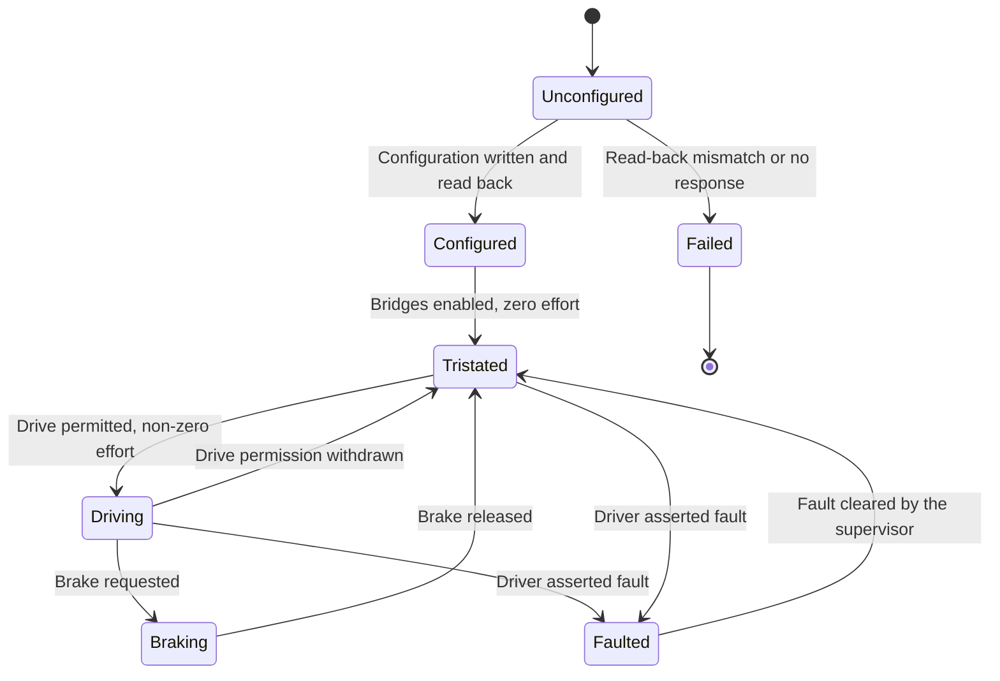
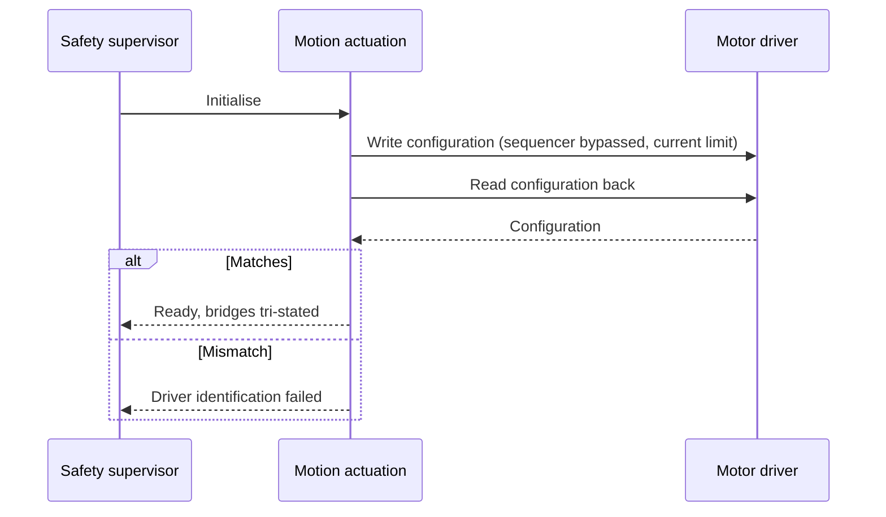
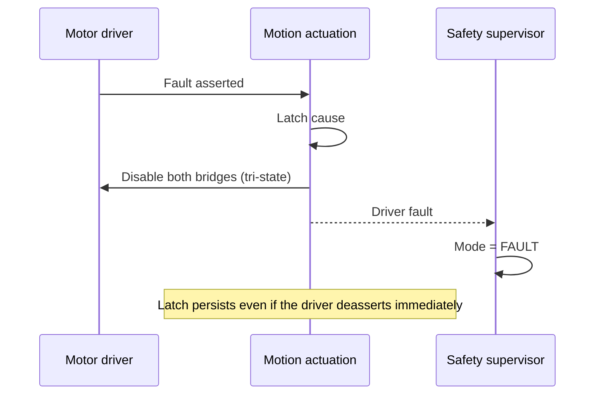
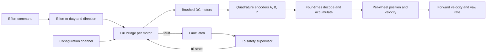

| Field     | Value                   |
|-----------|-------------------------|
| Title     | Motion Actuation Design |
| Type      | design                  |
| Status    | draft                   |
| Version   | 0.1.0                   |
| Component | motion-actuation        |
| Date      | 2026-09-16              |

> Turns an abstract effort command into current through two motors, and turns two encoder
> channel pairs back into measured motion. The one component that must always be able to
> stop, whatever else has failed.

---

## Responsibilities

**Is responsible for:**
- Configuring the motor driver at startup and verifying the configuration by read-back.
- Driving both full bridges directly, bypassing the driver's internal step sequencer.
- Mapping a signed effort command onto bridge duty cycle and direction.
- Providing tri-state and brake disable states, and guaranteeing the tri-state is always reachable.
- Observing the driver's fault output and reporting it to the safety supervisor.
- Decoding both quadrature encoders into signed wheel position and velocity.
- Deriving chassis forward velocity and yaw rate from the two wheel velocities.

**Is NOT responsible for:**
- Deciding what effort to apply, or whether the drive may be energised.
- Interpreting a fault beyond latching and reporting it.
- Estimating body attitude.
- Closing a current or velocity loop around the motors; effort maps to duty open-loop, and
  the outer loops live in balance control.

---

## Component Details

### Part A — One driver, two brushed motors

The motor driver part is nominally a stepper driver, but a stepper driver *is* two
independent full H-bridges plus a step sequencer. Bypassing the sequencer and driving the
two bridges directly yields exactly what a two-wheeled balancer needs: two independently
commanded brushed DC motors, per-motor current regulation, and a single fault output, all
configured over one serial channel.

The consequence for this design is that bridge state is commanded by the firmware on every
control iteration rather than delegated to the part. Each bridge takes **two logic-level
inputs**, so one driver needs four PWM lines in total — not four per motor. The part
generates its own gate drive and its own dead time, so the timer supplies plain
logic-level PWM: no complementary outputs, and no dead-time generator on the
microcontroller side.

Only one of a bridge's two inputs has to carry a duty cycle. Holding the other as a
direction level drives the motor sign-magnitude, which costs one timer channel per motor
instead of two. That matters because the two channels it frees are the only two the part
can decode quadrature on, and both wheels need one — see the platform design for the
allocation.

The choice is not free. Forward toggles the bridge between driven and released, reverse
between driven and shorted, so the two directions recirculate differently and their current
ripple is not symmetric. Commanded magnitude is unaffected and the effort mapping stays
monotonic, which is what Part C requires. The two motors also no longer share a timer, so
their switching edges are not phase-locked.

It also moves one input off the timer, and that has a safety consequence the board must
answer for. A break event forces a timer output to its idle state, which is low, but it
cannot touch a pin the timer does not own. With the magnitude input released and the
direction input left high, the bridge reads as fully reversed rather than released:

|                             | Magnitude input          | Direction input      | Bridge             |
|-----------------------------|--------------------------|----------------------|--------------------|
| Break while driving forward | low, forced by the timer | low                  | released           |
| Break while driving reverse | low, forced by the timer | **high, not forced** | **fully reversed** |

**The fault line must therefore pull both direction inputs low in hardware**, by an
open-drain gate or a device per pin. Without it the drive's hardware release is conditional
on the commanded direction, which is exactly the dependency the safety design exists to
remove. Firmware also drives the direction inputs low when it latches the fault, and the
driver disables its own outputs on its own faults, but neither is the unconditional
hardware path this requirement is about.

### Part B — Configuration and verification

Driver configuration — current limit, decay mode, sequencer bypass — is written during INIT
and read back. A driver that does not read back what was written is treated as absent, not
as merely misconfigured: energising motors through a driver in an unknown state is the
failure mode this check exists to prevent.

### Part C — Effort to duty mapping

Effort arrives normalised and signed. Its magnitude selects duty cycle, its sign selects
bridge direction. The mapping is monotonic and documented, so that a change in commanded
effort always produces a change in the same direction at the wheel — a property the control
strategies rely on and none of them verify.

Switching frequency sits above the audible band and is matched to the motor's electrical
time constant: too low and the robot whines and the current ripples; too high and switching
losses dominate.

### Part D — Tri-state, brake, and why safety uses the tri-state

Tri-stating opens both bridge legs, leaving the motor terminals floating; the robot's wheels
turn freely. Braking shorts the terminals, dissipating kinetic energy and resisting motion.

Both states are reached through the same two inputs, and the encoding is easy to get
backwards — driving both inputs low is a *tri-state*, not a brake:

| Input 1 | Input 2 | Bridge         | Meaning   |
|---------|---------|----------------|-----------|
| low     | low     | released       | Tri-state |
| PWM     | low     | driven forward | Forward   |
| low     | PWM     | driven reverse | Reverse   |
| high    | high    | both legs low  | Brake     |

Safety-initiated disables always tri-state. A falling robot that brakes plants its wheels and
converts a topple into a harder impact, and braking still drives current through the
bridges at the moment a fault is suspected. The tri-state is also what the hardware reaches
without firmware cooperation, which is what makes it reachable when the control loop is
already gone.

### Part E — Quadrature decoding

Each encoder's A and B channels are decoded in four-times quadrature, counting every edge
on both channels for maximum resolution. Counts accumulate into a wide software position
that is immune to the hardware counter wrapping. The index channel is reported as an event
for diagnostics and homing but is never allowed to reset the incremental count — a spurious
index pulse must not teleport the robot's odometry.

The two wheels are mirrored physically, so one encoder is configured with an inverted phase;
both then count up for forward robot motion and no sign correction is needed downstream.

### Part F — Chassis motion

Forward velocity is the mean of the two wheel velocities scaled by wheel radius; yaw rate is
their difference scaled by radius over track width. Both are derived here rather than in the
controller so that the wheel geometry is described in exactly one place.

---

## Interfaces

### Provided

| Interface          | Purpose                                        | Contract                                                                                    |
|--------------------|------------------------------------------------|---------------------------------------------------------------------------------------------|
| Effort application | Apply a signed effort to each motor            | Monotonic mapping to duty and direction; ignored unless the drive is permitted              |
| Drive disable      | Tri-state or brake both bridges                | The tri-state must succeed without a healthy control loop; safety disables always tri-state |
| Driver health      | Report driver-asserted faults                  | Latched on assertion, even if the condition clears immediately                              |
| Wheel measurement  | Signed position and angular velocity per wheel | Lossless across counter wrap; forward motion positive on both wheels                        |
| Index events       | Once-per-revolution marker per wheel           | Reported without disturbing the accumulated count                                           |
| Chassis motion     | Forward velocity and yaw rate                  | Derived from both wheels and the documented geometry; updated at the control-loop rate      |

### Required

| Interface                    | Purpose                                  | Contract                                                  |
|------------------------------|------------------------------------------|-----------------------------------------------------------|
| Driver configuration channel | Write and read back driver configuration | Read-back mismatch is a fatal startup condition           |
| Bridge control outputs       | Duty and direction per bridge            | Switching frequency above the audible band                |
| Driver fault input           | Observe the driver's fault assertion     | Observable without polling the configuration channel      |
| Encoder channel inputs       | A, B and index per wheel                 | Decoded without losing edges at maximum wheel speed       |
| Timebase                     | Velocity differencing interval           | Monotonic; the measured interval is used for differencing |

---

## Data Model

| Entity            | Field                   | Type / Unit        | Range                                   | Notes                                          |
|-------------------|-------------------------|--------------------|-----------------------------------------|------------------------------------------------|
| Command           | effortLeft, effortRight | normalised effort  | -1.0 to 1.0                             | Sign selects direction                         |
| Command           | disableState            | enumeration        | Tri-state, Brake                        | Safety paths use the tri-state exclusively     |
| Wheel measurement | position                | encoder counts     | full signed range                       | Accumulated across hardware wrap               |
| Wheel measurement | angularVelocity         | radians per second | -105 to 105                             | Differenced over the measured interval         |
| Chassis motion    | forwardVelocity         | metres per second  | -1.5 to 1.5                             | Mean of both wheels times wheel radius         |
| Chassis motion    | yawRate                 | radians per second | -3.1 to 3.1                             | Wheel difference times radius over track width |
| Geometry          | wheelRadius             | metres             | fitted value                            | Documented in one place only                   |
| Geometry          | trackWidth              | metres             | fitted value                            | Distance between wheel contact patches         |
| Geometry          | countsPerRevolution     | counts             | fitted value                            | Four times the encoder line count              |
| Configuration     | currentLimit            | amperes            | at or below the motor continuous rating | Verified by read-back                          |
| Configuration     | switchingFrequency      | kilohertz          | above 20                                | Above the audible band                         |

---

## State Machine

---

## Sequence Diagrams

Startup configuration.

A driver fault during flight.

---

## Block Diagram

---

## Constraints & Limitations

| Constraint              | Value / Description                                                                                                                    |
|-------------------------|----------------------------------------------------------------------------------------------------------------------------------------|
| Tri-state reachability  | Tri-stating must not depend on the control loop, the estimator or the link                                                             |
| Configuration trust     | An unverifiable driver configuration prevents startup rather than degrading operation                                                  |
| Switching frequency     | Above 20 kHz and compatible with the motor electrical time constant                                                                    |
| Current limit           | At or below the continuous rating of the fitted motors                                                                                 |
| Open-loop torque        | Effort maps to duty, not to current. Torque per unit effort varies with battery voltage and motor speed; the balance loops absorb this |
| No battery compensation | A discharging battery reduces the effort actually delivered; not compensated in this revision                                          |
| Index is advisory       | The index channel never corrects the incremental count, so absolute wheel angle is not established by this component                   |
| Slip is invisible       | Odometry measures wheel rotation, not ground motion. A slipping wheel reports travel that did not happen                               |

---

## Open Questions

| # | Question                                                                                                              | Options                                                                      | Status |
|---|-----------------------------------------------------------------------------------------------------------------------|------------------------------------------------------------------------------|--------|
| 1 | Is quadrature decoded by hardware timers or in software on edge interrupts?                                           | Hardware timer per wheel; software edge counting                             | open   |
| 2 | Should effort compensate for measured battery voltage so torque per unit effort stays constant as the battery drains? | Leave to the balance loops; add feed-forward compensation                    | open   |
| 3 | Fast or slow current decay mode for the bridges?                                                                      | Depends on measured current ripple against motor inductance                  | open   |
| 4 | Should wheel velocity be differenced per control period or filtered over several?                                     | Per period, accepting quantisation noise; short moving filter, accepting lag | open   |
| 5 | Should the driver's current regulation be relied upon, or a separate measurement taken?                               | Rely on the driver; add sensing for telemetry and stall detection            | open   |
