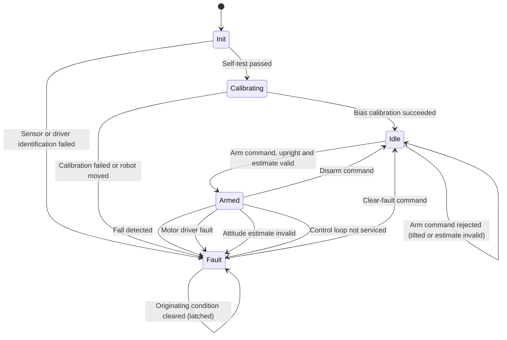

| Field     | Value                    |
|-----------|--------------------------|
| Title     | Safety Supervisor Design |
| Type      | design                   |
| Status    | draft                    |
| Version   | 0.1.0                    |
| Component | safety-supervisor        |
| Date      | 2026-09-16               |

> The supervisor owns the single decision that can hurt someone: whether the motors may
> be energised. Everything else in the firmware is advisory to it.

---

## Responsibilities

**Is responsible for:**
- Owning the operating mode and permitting only defined transitions between modes.
- Deciding whether the drive may be energised, and forcing it to a safe state otherwise.
- Detecting the four disarm conditions: a fall, a motor driver fault, loss of a valid
  attitude estimate, and a control loop that is no longer being serviced.
- Latching a fault together with its cause, and holding it until the operator clears it.
- Enforcing the preconditions on arming, and on strategy and parameter changes.
- Resetting the active control strategy on every transition into ARMED.

**Is NOT responsible for:**
- Computing effort commands — that is the balance controller's job.
- Deciding *how* the motors are disabled at the hardware level — it requests a coast; the
  actuation component knows how to produce one.
- Estimating attitude, or judging estimate quality beyond consuming the validity flag.
- Any communication with the operator; it publishes mode and fault cause, and the
  connectivity component carries them.

---

## Component Details

### Part A — Mode ownership

A single authoritative mode variable, written only by the supervisor. Every other
component reads it and none may change it. Transition requests arrive from the
connectivity component (arm, disarm, clear fault) or from internal detectors; each is
checked against the transition table for the active mode and rejected if not permitted.
Rejection is silent to the drive — a refused arm request leaves the system exactly as it
was.

### Part B — Fall detection

The supervisor compares the estimated pitch magnitude against the fall threshold on every
balance iteration. Crossing the threshold is not a recoverable event: the robot has
already lost the ability to catch itself, so the response is immediate coast and FAULT,
not a controller intervention. The threshold is deliberately well outside the recoverable
envelope — a 30-degree lean is the controller's problem; 35 degrees is the supervisor's.

### Part C — Fault aggregation and latching

Faults arrive from four independent sources and are normalised into a single latched
cause. Latching is the important property: once the robot has fallen, returning it to
upright must not silently re-enable the motors under the operator's hands. The latch
clears only on an explicit clear-fault command, and clearing the latch moves the system to
IDLE — never directly to ARMED. Arming is always a separate, deliberate second act.

### Part D — Liveness monitoring

The supervisor is fed by the balance loop, so a loop that stops running would otherwise
freeze the supervisor along with it. A timebase-driven check independent of the balance
loop counts missed services; three consecutive misses is a fault. This is the one detector
that must keep working when the rest of the control stack has stopped.

### Part E — Arming preconditions

Arming requires both a near-upright attitude and a valid estimate. The validity condition
matters as much as the angle: an estimator that has not converged can report upright while
being wrong. On a successful arm the supervisor resets the active strategy's internal state
so that behaviour never depends on history from a previous session.

---

## Interfaces

### Provided

| Interface | Purpose | Contract |
|-----------|---------|----------|
| Mode query | Report the active operating mode | Exactly one mode is active at any instant; readable from any context without blocking |
| Mode command | Request arm, disarm or clear-fault | Checked against the transition table; a rejected request changes nothing. Arming additionally requires upright attitude and a valid estimate |
| Fault report | Report the latched fault cause | Valid whenever the mode is FAULT; persists until the fault is cleared |
| Drive permission | Tell actuation and control whether the drive may be energised | Deasserted before the mode leaves ARMED, never after |
| Loop service notification | Accept the balance loop's periodic liveness signal | Absence for 3 consecutive periods is a fault |

### Required

| Interface | Purpose | Contract |
|-----------|---------|----------|
| Attitude estimate | Detect falls and check arming preconditions | Carries an explicit validity indication; the supervisor treats invalid as unsafe |
| Motor driver health | Observe driver-reported faults | An asserted fault is latched even if it clears immediately afterwards |
| Drive disable | Force both bridges to coast | Must succeed without a healthy control loop; coast, never brake |
| Strategy lifecycle | Reset the active strategy on arming | Reset completes before the drive is permitted |
| Timebase | Drive liveness monitoring | Independent of the balance loop it supervises |

---

## State Machine



Every edge into `Fault` coasts both bridges as its first action. There is deliberately no
edge from `Fault` directly to `Armed`.

---

## Sequence Diagrams

Fall detection — the path that must meet the 20 ms budget.

```mermaid
sequenceDiagram
    participant Est as Attitude estimation
    participant Sup as Safety supervisor
    participant Act as Motion actuation
    participant Ctrl as Balance control
    participant Link as Connectivity

    Est->>Sup: Pitch estimate, valid
    Note over Sup: Magnitude exceeds fall threshold
    Sup->>Act: Coast both bridges
    Act-->>Sup: Bridges disabled
    Sup->>Ctrl: Disable, drop effort to zero
    Sup->>Sup: Latch cause = Fall
    Sup-->>Link: Mode = FAULT, cause = Fall
```

Recovery — two deliberate operator acts, never one.

```mermaid
sequenceDiagram
    participant Op as Operator
    participant Link as Connectivity
    participant Sup as Safety supervisor
    participant Est as Attitude estimation
    participant Ctrl as Balance control

    Op->>Link: Clear fault
    Link->>Sup: Clear-fault request
    Sup->>Sup: Release latch
    Sup-->>Link: Mode = IDLE
    Note over Sup: Motors stay de-energised
    Op->>Link: Arm
    Link->>Sup: Arm request
    Sup->>Est: Attitude and validity
    Est-->>Sup: Within 5 degrees, valid
    Sup->>Ctrl: Reset strategy state
    Sup-->>Link: Mode = ARMED
```

---

## Data Model

| Entity | Field | Type / Unit | Range | Notes |
|--------|-------|-------------|-------|-------|
| Supervisor state | mode | enumeration | INIT, CALIBRATING, IDLE, ARMED, FAULT | Exactly one active |
| Supervisor state | latchedCause | enumeration | None, Fall, DriverFault, EstimateInvalid, LoopStalled, SelfTestFailed | Meaningful only in FAULT |
| Supervisor state | missedServices | count | 0 to 3 | Reset on each loop service; 3 triggers a fault |
| Configuration | fallThreshold | degrees | 35 | Magnitude of pitch from upright |
| Configuration | armWindow | degrees | 5 | Maximum tilt permitted when arming |
| Configuration | coastDeadline | milliseconds | 20 | Budget from detection to bridges disabled |

---

## Constraints & Limitations

| Constraint | Value / Description |
|------------|---------------------|
| Fall-to-coast budget | 20 ms from the estimate crossing the threshold to both bridges disabled |
| Liveness independence | The liveness monitor must not be driven by the loop it supervises |
| Disable path | Reaching a safe state must not depend on the control loop, the estimator or the link |
| No automatic recovery | There is no path from FAULT to ARMED without two separate operator commands |
| Flat ground only | The fall threshold assumes a level surface; a sloped surface narrows the effective recoverable envelope |
| Detection scope | The supervisor detects falls, not the causes of falls. A slipping wheel or a drained battery is visible only through its effect on attitude |

---

## Open Questions

| # | Question | Options | Status |
|---|----------|---------|--------|
| 1 | Should the fall threshold scale with measured wheel velocity, since a moving robot has less recovery margin? | Fixed threshold; velocity-dependent threshold | open |
| 2 | Should a hardware watchdog back the software liveness monitor? | Software only; add the microcontroller watchdog | open |
| 3 | Should battery voltage be a supervised fault source? | Out of scope this revision; add an undervoltage fault | open |
| 4 | Should repeated falls within a short window require a longer operator acknowledgement? | Treat every fall identically; escalate on repetition | open |
