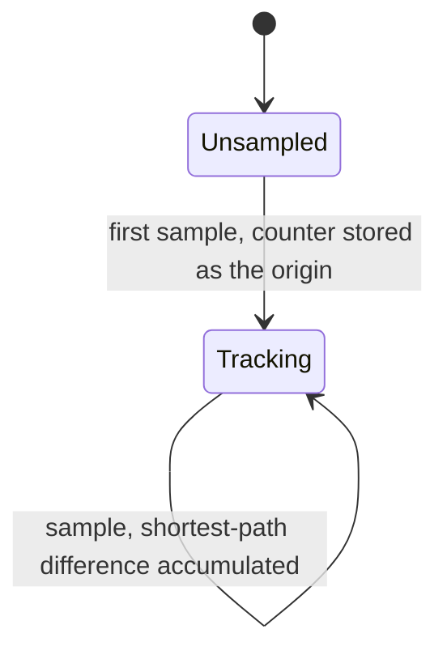
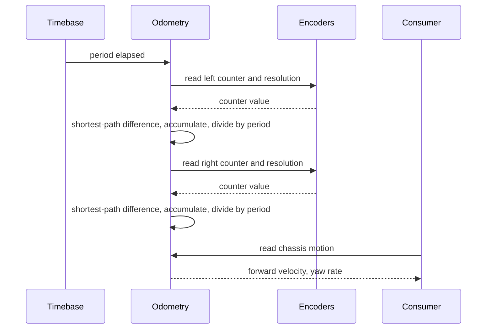
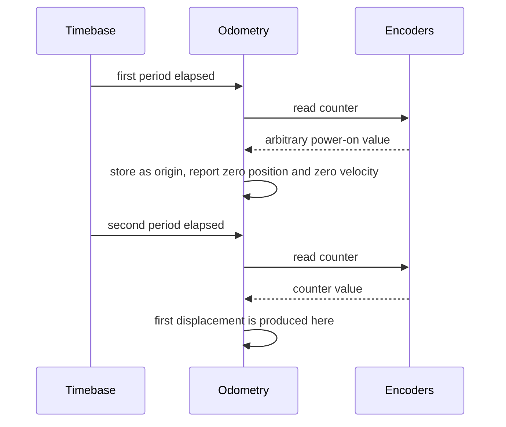
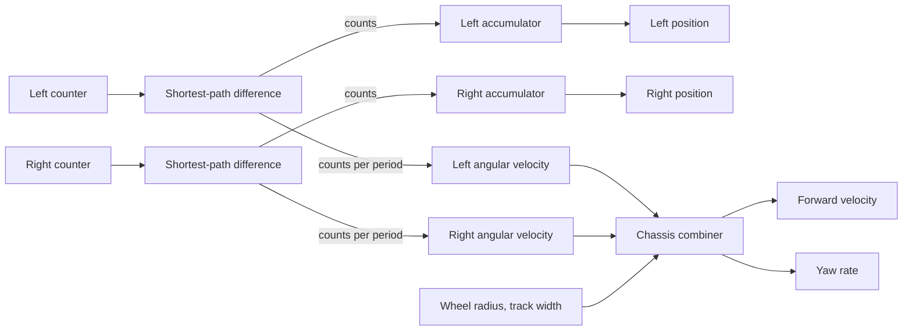

| Field     | Value                 |
|-----------|-----------------------|
| Title     | Wheel Odometry Design |
| Type      | design                |
| Status    | draft                 |
| Version   | 0.1.0                 |
| Component | wheel-odometry        |
| Date      | 2026-09-19            |

> Turns two sixteen-bit hardware counters that wrap every revolution into a signed wheel
> position that never wraps, a wheel angular velocity, and the chassis forward velocity and
> yaw rate the outer control loop steers on.

---

## Responsibilities

**Is responsible for:**
- Sampling both encoder counters on a fixed cadence that it owns.
- Accumulating a signed per-wheel position that survives hardware counter wrap-around
  without losing or duplicating counts.
- Deriving a signed angular velocity per wheel from the counts observed in the last interval.
- Deriving chassis forward velocity and yaw rate from the two wheel velocities and the
  documented wheel geometry.
- Holding the wheel geometry — radius, track width, gear ratio — in exactly one place.

**Is NOT responsible for:**
- Decoding quadrature edges. The hardware timer does that; this component only reads the
  resulting counter.
- Correcting for the mirrored wheel mounting. The platform layer inverts one encoder phase
  so both counters already count up for forward robot motion, and correcting again here
  would cancel it.
- Reporting the once-per-revolution index event. See **Open Questions**.
- Filtering, smoothing or fusing. The estimate it publishes is a raw difference; any
  filtering belongs to the consumer that knows its own bandwidth.
- Integrating a pose. Heading and position on the floor are not derived here; the component
  reports rates, not where the robot is.

---

## Component Details

### Part A — The hardware decodes, this component accumulates

Each wheel has a timer running in encoder mode. The timer counts quadrature edges on both
channels and presents a counter in the range zero to one below the configured resolution.
It wraps in both directions and gives no indication that it has done so.

The whole value this component adds over the raw counter is to turn that wrapping,
resolution-bounded number into a wide signed position that only ever changes by the amount
the wheel actually turned. On each sample it reads the counter, forms the difference against
the previous reading, and folds that difference into the shorter of the two ways around the
counter: a difference of more than half the resolution is reinterpreted as the same journey
taken the other way. A wheel that runs forwards past the counter maximum therefore reads as a
small positive step, not as a revolution backwards, and the accumulated position continues
monotonically.

A difference of *exactly* half the resolution is the one case no rule can get right. A half-turn
forwards and a half-turn backwards produce the identical pair of counter readings, so the
information needed to tell them apart is not present. The tie is broken deterministically rather
than arbitrarily: the raw difference is kept as it stands, so the reported sign follows the order
the two readings were taken in. Reading 0 then half the resolution is reported as forward; reading
half the resolution then 0 is reported as reverse. Part B says why the cadence keeps the robot well
clear of this point, and the alternative — refusing to run when a wheel reaches it — is the wrong
failure mode for a machine that falls over when it stops balancing.

The first sample after construction only seeds the previous reading. It cannot produce a
displacement, because there is nothing to difference against, and inventing one would
attribute the counter's arbitrary power-on value to motion that never happened. Position and
velocity both stay at zero until the second sample.

### Part B — The sampling cadence is a correctness constraint, not a tuning knob

Shortest-path reconstruction is only correct while the wheel turns by less than half the
resolution between two samples. Past that the reconstruction silently chooses the wrong
direction, and the error is not a small one — it is a whole revolution, in the wrong sign.

That makes the sample period part of the component's contract rather than something a caller
may set freely, which is why the component owns its own periodic sampling instead of waiting
to be driven by whatever loop happens to consume it. A control loop that stalls, runs slow,
or is not yet written cannot corrupt the accumulated position.

With the default resolution of 4096 counts per revolution and a 20 millisecond period, the
ceiling is just under half a revolution per sample — half itself is the ambiguous case described
in Part A, so the last unambiguous count is one below it:

| Quantity                       | Value                      |
|--------------------------------|----------------------------|
| Counts per revolution          | 4096                       |
| Sample period                  | 20 ms                      |
| Unambiguous counts per sample  | 2047                       |
| Maximum trackable wheel rate   | under 25 rev/s ≈ 1499 rpm  |
| Maximum trackable ground speed | ≈ 5.3 m/s at a 34 mm wheel |

The chassis is designed for at most 1.5 m/s, so the margin is better than a factor of three.
The figure is recorded because it moves: a finer encoder, a longer period, or a gearbox
between encoder and wheel all lower it, and a change to any of the three has to be checked
against this table rather than assumed safe.

### Part C — Velocity is differenced position, not the driver's speed reading

The encoder driver also offers a speed reading of its own. It is deliberately not used. That
reading is an unsigned magnitude sampled on the driver's own period, so it carries no
direction, and it resolves wrap by trusting the counter's instantaneous direction flag —
which is the direction of the last edge, not of the interval. A balance controller needs the
sign far more than it needs the magnitude, so velocity is instead the displacement of the
last interval divided by the interval, which is signed by construction and consistent with
the position it is derived from.

Velocity therefore inherits the counting resolution directly: one count per interval is
0.077 rad/s at the wheel, about 2.6 mm/s of ground speed. Sampling faster would lower the
aliasing ceiling in Part B *and* make velocity noisier, because the same one-count
quantisation is divided by a shorter interval. Twenty milliseconds is chosen to match the
outer control loop, which is the only consumer of velocity; the inner balance loop runs on
attitude, not on odometry.

### Part D — Chassis motion

The two wheel velocities are combined into the chassis motion the outer loop actually steers
on. Forward velocity is the mean of the two wheel velocities scaled by the wheel radius; yaw
rate is their difference scaled by the radius over the track width. Driving both wheels
equally gives a pure forward velocity and no yaw; driving them equally and oppositely gives a
pure yaw and no forward velocity.

Yaw is positive when the right wheel runs ahead of the left, which is the robot turning to
its left. Both are derived here, beside the geometry they depend on, so that a consumer never
has to know the wheel radius or the track width to interpret what it is given.

### Part E — Sign convention is settled before this component sees it

Requirement REQ-ODOM-003 asks that forward robot motion be positive on both wheels. The two
wheels face opposite ways on the chassis, so one encoder would otherwise count down while the
other counts up.

This is resolved one layer below, in the platform implementation, by inverting one encoder's
phase-A polarity in hardware. By the time this component reads a counter, both already count
up for forward motion. The important consequence is negative: this component must **not**
apply a sign correction of its own, because it would cancel the hardware one and reintroduce
exactly the fault the requirement forbids. There is no left-versus-right asymmetry anywhere
in the accumulation or the velocity path, and there should not be one.

---

## Interfaces

### Provided

| Interface      | Purpose                                        | Contract                                                                                           |
|----------------|------------------------------------------------|----------------------------------------------------------------------------------------------------|
| Wheel motion   | Signed position and angular velocity per wheel | Lossless across counter wrap; forward motion positive on both wheels; zero until the second sample |
| Chassis motion | Forward velocity and yaw rate                  | Derived from both wheel velocities and the documented geometry; refreshed on every sample          |

The provided interface is read-only. Consumers observe the latest estimate; they do not drive
the sampling and cannot advance, reset or reseed the accumulated position.

### Required

| Interface         | Purpose                                | Contract                                                                                        |
|-------------------|----------------------------------------|-------------------------------------------------------------------------------------------------|
| Wheel encoders    | Counter value and resolution per wheel | Counter strictly below the resolution; resolution at least two and constant                     |
| Periodic timebase | Drive the sampling cadence             | Fires on the configured period; a sample must not be skipped or the ceiling in Part B is halved |

---

## Data Model

| Entity         | Field           | Type / Unit        | Range             | Notes                                                         |
|----------------|-----------------|--------------------|-------------------|---------------------------------------------------------------|
| Wheel motion   | position        | encoder counts     | full signed range | Accumulated across hardware wrap; zero at construction        |
| Wheel motion   | angularVelocity | radians per second | -105 to 105       | Displacement of the last interval over the sample period      |
| Chassis motion | forwardVelocity | metres per second  | -1.5 to 1.5       | Mean of both wheel velocities times the wheel radius          |
| Chassis motion | yawRate         | radians per second | -3.1 to 3.1       | Wheel difference times radius over track width; positive left |
| Configuration  | samplePeriod    | microseconds       | greater than zero | Bounds the maximum trackable wheel rate — see Part B          |
| Configuration  | wheelRadius     | metres             | greater than zero | Fitted value; documented in one place only                    |
| Configuration  | trackWidth      | metres             | greater than zero | Distance between the wheel contact patches                    |
| Configuration  | gearRatio       | encoder per wheel  | greater than zero | Encoder revolutions per wheel revolution; one when direct     |

---

## State Machine

Each wheel carries one bit of state beyond its accumulated position: whether it has ever been
sampled. The bit exists so that the arbitrary counter value present at power-on is treated as
an origin rather than as a displacement.

There is no path back to Unsampled. Nothing reseeds a wheel once it is tracking, and in
particular the index pulse does not, which is what REQ-ODOM-005 protects.

---

## Sequence Diagrams

Steady-state sampling, showing that consumers are decoupled from the cadence:

Start-up, showing that the first sample yields no motion:

---

## Block Diagram

---

## Constraints & Limitations

| Constraint                   | Value / Description                                                                                                                                         |
|------------------------------|-------------------------------------------------------------------------------------------------------------------------------------------------------------|
| Maximum trackable wheel rate | Just under half the resolution per sample — 2047 counts, under 25 rev/s at 4096 counts and 20 ms. Beyond it the position is wrong by a revolution, silently |
| Exactly half the resolution  | Inherently ambiguous; the tie falls to the raw difference, so the sign follows the order the readings were taken in — see Part A                            |
| Missed sample                | A skipped period halves the ceiling for that interval, and reports the two periods' motion as one period's velocity                                         |
| Velocity quantisation        | One count per period: 0.077 rad/s at the wheel, about 2.6 mm/s of ground speed                                                                              |
| Velocity is unfiltered       | A single-interval difference; consumers needing smoothness filter at their own bandwidth                                                                    |
| Geometry is nominal          | Wheel radius, track width and gear ratio are configured values, not measured ones; nothing here detects a wrong one                                         |
| Slip is invisible            | A wheel that spins without the chassis moving reports motion that did not happen. Odometry is dead reckoning                                                |
| Accumulator range            | Signed 32-bit counts — about 524 288 revolutions at the default resolution, far beyond any run length                                                       |
| No heap, no recursion        | Fixed-size state, two wheels, no dynamic allocation on any path                                                                                             |

---

## Open Questions

| # | Question                                                                            | Options                                                                                                                                       | Status                                                         |
|---|-------------------------------------------------------------------------------------|-----------------------------------------------------------------------------------------------------------------------------------------------|----------------------------------------------------------------|
| 1 | How is the once-per-revolution index event exposed (REQ-ODOM-005)?                  | Extend the portable encoder interface with an index accessor; add an interrupt-driven index latch in the hardware layer; drop the requirement | open — see the note below                                      |
| 2 | Are the wheel radius, track width and gear ratio defaults the built robot's values? | Measure on the assembled chassis; fit from a straight-line and a spin-in-place run                                                            | open — defaults are placeholders                               |
| 3 | Should velocity be filtered before the outer loop sees it?                          | Leave raw and let balance control filter; add a configurable first-order filter here                                                          | open — raw for now, decided by the balance loop's noise budget |

**On question 1.** The requirement cannot be met through the interface this component consumes:
the portable encoder abstraction exposes counter, resolution, direction and speed, and has no
index accessor at all. The hardware layer does have one, but it is a bare level read of the
index pin with no latch and no interrupt behind it. Polling it at the sampling cadence would
catch a pulse that is present for a fraction of a revolution only occasionally, and reporting
an index event that is missed most of the time is worse than reporting none.

Closing it needs a change one layer down — an index accessor on the portable interface, backed
by a latch or an edge interrupt in the hardware layer — not a change here. Until then
REQ-ODOM-005 is explicitly unmet, and is recorded as unmet rather than quietly approximated.
The half of the requirement that *is* met is the half that matters for safety: nothing in this
component lets an index pulse disturb the accumulated count, because the count never consults
it.
