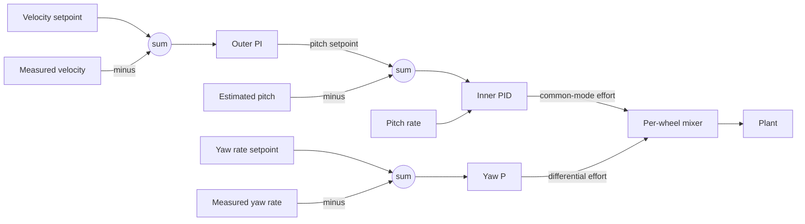
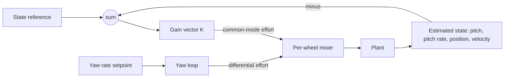

| Field     | Value                  |
|-----------|------------------------|
| Title     | Balancing Control Laws |
| Type      | theory                 |
| Status    | draft                  |
| Version   | 0.1.0                  |
| Component | balance-control        |
| Date      | 2026-09-16             |

> Two ways to stabilise the same plant. This document derives both from the model in
> `pendulum-dynamics.md` and states what *any* law must satisfy — which is the theoretical
> justification for making the control law a runtime choice rather than an architectural one.

---

## Overview

The plant is open-loop unstable with a pole at $+1/\tau$. Stabilising it means placing every
closed-loop pole in the left half plane using the one common-mode input available, while
also regulating position — two objectives through one actuator.

This document derives two laws that do it. **Cascaded PID** nests a fast pitch loop inside a
slower velocity loop, exploiting a timescale separation. **LQR** feeds back all four states
through a single gain vector chosen to minimise a quadratic cost. They look different but
produce the same kind of object: a map from measured state and setpoints to a common-mode
effort.

The main result is the **stabilisability condition** every law must meet — the closed-loop
characteristic polynomial must be Hurwitz, which for this plant requires genuine feedback on
both $\theta$ and $\dot{\theta}$:

$$
\det\!\left(sI - (A - BK)\right) \ \text{Hurwitz}
\quad\Longrightarrow\quad
k_\theta > \frac{M_t\, m g \ell}{\beta}, \qquad k_{\dot\theta} > 0
$$

Because this condition is a property of the *plant*, not of any particular law, the
requirements in `documentation/requirements/balance-control.yaml` are stated as outcomes and
any conforming strategy may satisfy them.

---

## Prerequisites

The linearised model and symbols from `pendulum-dynamics.md`. Classical loop shaping (PID,
phase margin), state-space feedback, controllability, and the algebraic Riccati equation.

| Symbol | Meaning | Unit |
|--------|---------|------|
| $\mathbf{z}$ | State vector $[\theta,\ \dot{\theta},\ x,\ \dot{x}]^{\top}$ | mixed |
| $u$ | Common-mode control effort (torque) | N·m |
| $A,\ B$ | Linearised state and input matrices | — |
| $K$ | State feedback gain vector | mixed |
| $\mathcal{C}$ | Controllability matrix | — |
| $Q,\ R$ | LQR state and input weighting matrices | — |
| $P$ | Solution of the algebraic Riccati equation | — |
| $\alpha$ | Plant gravity coefficient, $M_t m g \ell / \Delta$ | 1/s² |
| $\beta$ | Plant input coefficient on pitch, $(M_t + m\ell/r)/\Delta$ | 1/(kg·m²) |
| $k_\theta,\ k_{\dot\theta}$ | Feedback gains on pitch and pitch rate | mixed |
| $\theta^\*$ | Pitch setpoint produced by the outer loop | rad |
| $\omega_i,\ \omega_o$ | Inner and outer loop bandwidths | rad/s |

---

## Mathematical Foundation

### Model / Setup

From `pendulum-dynamics.md`, with $\alpha = M_t m g \ell/\Delta$ and
$\beta = (M_t + m\ell/r)/\Delta$:

$$
\ddot{\theta} = \alpha\theta - \beta u
$$

and in state-space form $\dot{\mathbf{z}} = A\mathbf{z} + Bu$ with

$$
A = \begin{bmatrix} 0 & 1 & 0 & 0 \\ \alpha & 0 & 0 & 0 \\ 0 & 0 & 0 & 1 \\ -\gamma & 0 & 0 & 0 \end{bmatrix},
\qquad
B = \begin{bmatrix} 0 \\ -\beta \\ 0 \\ \delta \end{bmatrix}
$$

where $\gamma = m^{2}\ell^{2}g/\Delta$ and $\delta = (J_t/r + m\ell)/\Delta$.

**Controllability.** Stabilisation is only possible if the plant is controllable. Forming
$\mathcal{C} = [B,\ AB,\ A^{2}B,\ A^{3}B]$ gives

$$
\det\mathcal{C} = \beta^{2}\!\left(\alpha\delta - \beta\gamma\right)^{2} \neq 0
$$

for physically realisable parameters, so $\mathcal{C}$ has full rank and **all four poles can
be placed arbitrarily**. This is the licence for everything below; both laws exist because
this determinant is non-zero.

### Derivation

#### Part 1 — Why a single pitch loop is not enough

Take the simplest candidate, proportional-derivative feedback on pitch alone:
$u = k_\theta\theta + k_{\dot\theta}\dot{\theta}$. Substituting into $\ddot\theta = \alpha\theta - \beta u$:

$$
\ddot{\theta} + \beta k_{\dot\theta}\dot{\theta} + (\beta k_\theta - \alpha)\theta = 0
$$

By the Routh–Hurwitz criterion this is stable exactly when

$$
k_\theta > \frac{\alpha}{\beta} = \frac{M_t\, m g \ell}{M_t + m\ell/r}, \qquad k_{\dot\theta} > 0
$$

The first condition is the interesting one: the proportional gain must exceed a **finite
positive threshold** set by gravity. Below it the robot falls regardless of how the
derivative term is tuned — there is no gentle degradation, the law simply does not work.

But this stabilises $\theta$ while saying nothing about $x$. Examining the position equation
under this law shows $x$ drifting without bound: the robot balances beautifully while
wandering across the room. Both remaining laws are answers to that problem.

#### Part 2 — Cascaded PID

The cascade answers it by making the *pitch setpoint* the outer loop's control variable. To
travel forwards, lean forwards; to stop, stand up.

**Inner loop** drives $\theta$ to a setpoint $\theta^\*$:

$$
u = K_p^{i}(\theta - \theta^\*) + K_i^{i}\!\int(\theta - \theta^\*)\,dt + K_d^{i}\,\dot{\theta}
$$

with $K_p^{i} > \alpha/\beta$ inherited from Part 1. The derivative term uses the measured
pitch rate directly rather than differentiating the angle — the estimator already provides
$\dot{\theta}$, and differentiating a noisy angle would inject noise straight into the
actuator.

**Outer loop** produces $\theta^\*$ from the velocity error:

$$
\theta^\* = -\left[K_p^{o}(\dot{x} - \dot{x}^\*) + K_i^{o}\!\int(\dot{x} - \dot{x}^\*)\,dt\right]
$$

The negative sign is the physics of Part 1's sign structure: to increase forward velocity the
robot must pitch *forward*, into the direction of travel.

**Timescale separation.** The cascade is valid only if the inner loop settles before the
outer meaningfully moves its setpoint. The standard requirement is

$$
\omega_i \gtrsim 5\,\omega_o
$$

Violating it does not produce an obvious failure — it produces a slow oscillation as the two
loops fight, which is easily mistaken for bad tuning. This is why the design fixes the loops
at 500 Hz and 50 Hz, a decade apart.

**Yaw** is a separate single loop on the differential torque:
$\tau_d = K_p^{\psi}(\dot{\psi} - \dot{\psi}^\*)$, stable for any positive gain because yaw is
not an unstable mode.

#### Part 3 — Linear quadratic regulator

The LQR answers the same problem by refusing to separate the objectives. Choose the gain that
minimises

$$
J = \int_0^{\infty}\left(\mathbf{z}^{\top}Q\mathbf{z} + u^{\top}Ru\right)dt
$$

with $Q \succeq 0$ weighting state deviations and $R \succ 0$ penalising effort. The optimum
is $u = -K\mathbf{z}$ with

$$
K = R^{-1}B^{\top}P
$$

where $P$ solves the continuous-time algebraic Riccati equation

$$
A^{\top}P + PA - PBR^{-1}B^{\top}P + Q = 0
$$

Because the plant is controllable and $R \succ 0$, a unique positive-definite $P$ exists and
the closed loop $A - BK$ is guaranteed Hurwitz. That guarantee is the LQR's real advantage:
stability is not something to be verified after tuning, it is a property of the construction.

Tuning moves from four coupled gains to the entries of $Q$ and $R$, which carry physical
meaning — how much pitch error is worth how much position error is worth how much effort. A
practical starting point is Bryson's rule, weighting each term by the reciprocal square of its
acceptable deviation:

$$
Q_{ii} = \frac{1}{z_{i,\max}^{2}}, \qquad R = \frac{1}{u_{\max}^{2}}
$$

The Riccati equation is solved **offline**; the firmware evaluates only the inner product
$u = -K\mathbf{z}$, four multiply-accumulates per iteration.

#### Part 4 — What any law must satisfy

Both laws produce a closed loop of the form $\dot{\mathbf{z}} = (A - BK_{\text{eff}})\mathbf{z}$ —
the cascade's $K_{\text{eff}}$ is structured and derived from nested loops, the LQR's is dense
and derived from the Riccati equation, but the stability question is identical. A conforming
strategy must:

1. place all closed-loop poles in the left half plane, requiring feedback on both $\theta$
   and $\dot{\theta}$ with $k_\theta$ above the gravity threshold;
2. regulate $x$ or $\dot{x}$, or drift without bound;
3. produce bounded effort, since the derivations assume the actuator is not saturated;
4. execute in bounded time within the loop period.

Nothing beyond this is a property of the law. **That is precisely why the control law can be
a runtime selection**: the interface in `documentation/design/balance-control.md` demands only
these four properties, and the requirements are written as the outcomes they produce.

### Key Results

$$
\begin{aligned}
\text{Stabilisability:}\quad & k_\theta > \frac{\alpha}{\beta} = \frac{M_t\, m g \ell}{M_t + m\ell/r}, \qquad k_{\dot\theta} > 0\\[2mm]
\text{Cascade (inner):}\quad & u = K_p^{i}(\theta - \theta^\*) + K_i^{i}\!\int(\theta-\theta^\*)dt + K_d^{i}\dot{\theta}\\[2mm]
\text{Cascade (outer):}\quad & \theta^\* = -\left[K_p^{o}(\dot{x}-\dot{x}^\*) + K_i^{o}\!\int(\dot{x}-\dot{x}^\*)dt\right], \qquad \omega_i \gtrsim 5\omega_o\\[2mm]
\text{LQR:}\quad & u = -K\mathbf{z}, \quad K = R^{-1}B^{\top}P, \quad A^{\top}P + PA - PBR^{-1}B^{\top}P + Q = 0
\end{aligned}
$$

---

## Block Diagrams

Cascaded PID — two nested loops plus an independent yaw loop.



LQR — one gain vector across the whole state.



Both reduce to the same closed-loop structure, which is what the strategy interface encodes:

```
   setpoints ──►┌──────────────┐── effort ──►┌───────┐──► state
                │  strategy    │             │ plant │      │
                └──────────────┘             └───────┘      │
                       ▲                                    │
                       └────────── estimated state ─────────┘
```

---

## Numerical Properties

| Property   | Value / Condition |
|------------|-------------------|
| Complexity | Cascade: about 20 multiply-accumulates per iteration across three loops. LQR: 4 multiply-accumulates for the inner product, plus the yaw loop. Both are trivial against a 500 Hz budget on a Cortex-M4 with hardware floating point |
| Precision | Single precision throughout. Integral terms accumulate over thousands of iterations and are the only real precision concern; they are bounded by anti-windup clamping, which also bounds the accumulated rounding error |
| Stability | Cascade: stable when $K_p^{i} > \alpha/\beta$, $K_d^{i} > 0$ and $\omega_i \gtrsim 5\omega_o$. LQR: guaranteed Hurwitz by construction for $Q \succeq 0$, $R \succ 0$ and controllable $(A,B)$ |
| Range | Valid while the linearisation holds, to roughly 15° of pitch, and while the effort command is unsaturated |

**Sensitivities.** The dominant sensitivity is to **loop rate and latency**, not to gains.
A discrete implementation adds phase lag of approximately $\omega T_s/2$ radians from
sampling plus the computation latency; at 500 Hz and a 3 ms sensor-to-actuator budget this
costs a few degrees of phase margin, which is affordable. Halving the rate roughly doubles
the lag and can consume the entire margin of an otherwise well-tuned controller — a
controller that works at 500 Hz and fails at 100 Hz has not been mistuned, it has run out of
phase.

The next most sensitive quantity is the **derivative path**. $K_d^{i}$ acts on the estimated
pitch rate, so estimator noise is amplified directly into the actuator; this is the coupling
that ties controller performance to the estimator quality specified in
`attitude-estimation.md`.

**Integral windup** is the classic practical failure. Holding the robot against a wall
saturates the effort while the integral term keeps accumulating; on release the discharge
produces a violent lurch. Clamping the integrator whenever the output is saturated is not an
optimisation but a correctness requirement — hence `REQ-CTRL-009`.

Both laws are **robust to modest parameter error**. Mass and inertia estimates within about
20% are typically absorbed by the gain margin, which is fortunate because $J$ is difficult to
measure directly. The LQR is the more sensitive of the two, since its optimality is defined
against the model it was computed from; the cascade is tuned against the real robot and so
absorbs model error implicitly.

---

## Worked Example

Using the representative balancer from `pendulum-dynamics.md`: $m = 0.8$ kg, $M = 0.2$ kg,
$\ell = 0.10$ m, $J = 0.004$ kg·m², $r = 0.034$ m, $J_w = 6\times10^{-5}$ kg·m².

$$
M_t = 0.2 + 0.8 + \frac{2(6\times10^{-5})}{0.034^{2}} \approx 1.10\ \text{kg},
\qquad
J_t = 0.004 + 0.8(0.01) = 0.012\ \text{kg·m}^{2}
$$

$$
\Delta = (1.10)(0.012) - (0.8)^{2}(0.10)^{2} \approx 0.0068
$$

$$
\alpha = \frac{1.10 \times 0.8 \times 9.81 \times 0.10}{0.0068} \approx 127\ \text{s}^{-2},
\qquad
\beta = \frac{1.10 + \frac{0.8 \times 0.10}{0.034}}{0.0068} \approx 508
$$

The stabilisability threshold is therefore

$$
K_p^{i} > \frac{\alpha}{\beta} = \frac{127}{508} \approx 0.25\ \text{N·m/rad}
$$

A practical starting gain is several times this — say $K_p^{i} \approx 1.0$ N·m/rad — placing
the closed-loop poles comfortably inside the left half plane. With $K_d^{i} = 0.08$ N·m·s/rad
the closed-loop pitch dynamics become

$$
\ddot{\theta} + 40.6\,\dot{\theta} + 381\,\theta = 0
$$

giving $\omega_n \approx 19.5$ rad/s and $\zeta \approx 1.04$ — slightly overdamped, settling
in roughly 0.2 s, which meets the 1 s disturbance-recovery requirement with wide margin. The
outer loop then takes $\omega_o \approx 19.5/5 \approx 3.9$ rad/s, comfortably served by the
50 Hz outer loop.

Note $\omega_n \tau \approx 19.5 \times 0.13 \approx 2.5$: the closed loop is faster than the
fall by a healthy factor, which is the whole game.

---

## Limitations & Assumptions

- **Assumes**: the linearised plant of `pendulum-dynamics.md`, with all its assumptions —
  no slip, flat ground, small angles, rigid body.
- **Assumes**: the estimator supplies $\theta$ and $\dot{\theta}$ with negligible lag relative
  to the loop rate. Estimator lag is indistinguishable from actuator lag and consumes the
  same phase margin.
- **Assumes**: torque is commanded directly. Effort actually maps to bridge duty open-loop,
  so torque per unit effort varies with battery voltage and motor speed — absorbed as gain
  variation, not modelled.
- **Assumes**: unsaturated effort. Every stability result above is void while the actuator is
  clamped, which is why anti-windup is a requirement rather than a refinement.
- **Does not handle**: swing-up or recovery from a fall. These laws are local stabilisers,
  valid near upright only.
- **Does not handle**: slopes. Both laws hold zero pitch relative to gravity, so on an incline
  the robot creeps unless the operator commands against it.
- **Does not handle**: adaptive or gain-scheduled control. Gains are fixed within a session;
  changing payload requires retuning.
- **Does not handle**: explicit robustness synthesis. Neither law comes with a guaranteed
  stability margin against parameter error; robustness is empirical.

---

## References

1. Åström, K. J. and Murray, R. M. *Feedback Systems*, 2nd ed. — state feedback,
   controllability, and the LQR.
2. Åström, K. J. and Hägglund, T. *Advanced PID Control*. ISA, 2006 — cascade control,
   derivative-on-measurement, and anti-windup.
3. Anderson, B. D. O. and Moore, J. B. *Optimal Control: Linear Quadratic Methods*. —
   the algebraic Riccati equation and guaranteed stability of the LQR.
4. Bryson, A. E. and Ho, Y.-C. *Applied Optimal Control* — the weighting rule used above.
5. Franklin, G. F., Powell, J. D. and Workman, M. *Digital Control of Dynamic Systems*,
   3rd ed. — sampling lag, discretisation, and its effect on phase margin.
