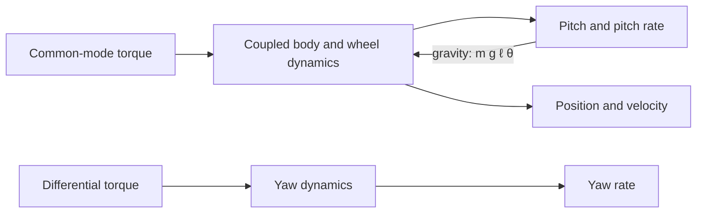

| Field     | Value                                  |
|-----------|----------------------------------------|
| Title     | Two-Wheeled Inverted Pendulum Dynamics |
| Type      | theory                                 |
| Status    | draft                                  |
| Version   | 0.1.0                                  |
| Component | balance-control                        |
| Date      | 2026-09-16                             |

> The plant model every control strategy is designed against. This document derives it and
> establishes *why* the robot is unstable, which sets the loop rate and latency budgets the
> rest of the system is built to.

---

## Overview

A two-wheeled balancing robot is a pendulum standing on a cart, where the cart is the wheel
pair and the pendulum is the body. Left alone it falls: gravity acting on a body displaced
from vertical produces a torque that increases the displacement. The only way to stay
upright is to drive the wheels so that the support point keeps moving back underneath the
centre of mass.

The main results are the linearised equations of motion about the upright equilibrium, and
the open-loop pole that follows from them. That pole gives the **time constant of the fall**

$$
\tau = \sqrt{\frac{J + m\ell^{2}}{m g \ell}}
$$

which is the number that justifies the 500 Hz loop rate and the 3 ms latency budget: a
controller must act many times within $\tau$ to have authority over the fall.

This document is deliberately law-agnostic. It produces the plant; `control-laws.md` derives
the strategies that stabilise it.

---

## Prerequisites

Newtonian rigid-body mechanics, linearisation of a nonlinear system about an equilibrium,
and state-space notation. Familiarity with poles of a linear system and what a
right-half-plane pole implies.

| Symbol | Meaning | Unit |
|--------|---------|------|
| $\theta$ | Body pitch angle from vertical, positive nose-up | rad |
| $\dot{\theta}$ | Body pitch rate | rad/s |
| $x$ | Horizontal position of the wheel axle | m |
| $\dot{x}$ | Forward velocity of the chassis | m/s |
| $\psi$ | Chassis yaw angle | rad |
| $\dot{\psi}$ | Chassis yaw rate | rad/s |
| $m$ | Body mass (everything above the axle) | kg |
| $M$ | Combined mass of both wheels and rotors | kg |
| $\ell$ | Distance from the wheel axle to the body centre of mass | m |
| $J$ | Body moment of inertia about the axle | kg·m² |
| $J_w$ | Moment of inertia of one wheel about its axis | kg·m² |
| $r$ | Wheel radius | m |
| $b$ | Track width between wheel contact patches | m |
| $\tau_L,\ \tau_R$ | Torque applied to the left and right wheels | N·m |
| $\tau_c$ | Common-mode wheel torque, $\tau_L + \tau_R$ | N·m |
| $\tau_d$ | Differential wheel torque, $\tau_L - \tau_R$ | N·m |
| $g$ | Gravitational acceleration, 9.81 | m/s² |
| $\tau$ | Fall time constant | s |

---

## Mathematical Foundation

### Model / Setup

The robot is modelled as two rigid bodies: a body of mass $m$ pivoting freely about the
wheel axle, and a wheel pair of combined mass $M$ rolling without slipping on flat ground.

Three assumptions make the problem tractable, and each is a real limitation recorded below:
the wheels roll without slipping, so wheel rotation and ground travel are related by
$x = r\phi$; the ground is flat and rigid; and the longitudinal (pitch) and rotational (yaw)
dynamics decouple, so the two-wheeled robot can be treated as a planar cart-pole driven by
the common-mode torque $\tau_c$, with yaw driven separately by $\tau_d$.

```
                    ● centre of mass (m, J)
                   /
                  /  ℓ
                 /
          θ ↘   /
        ┄┄┄┄┄┄●┄┄┄┄┄┄  wheel axle
             ╱ ╲
            (   )  wheel, radius r, mass M
        ════════════  ground
                 →  x
```

The planar configuration is $(x, \theta)$, with the yaw coordinate $\psi$ handled separately.

### Derivation

**Step 1 — Kinetic and potential energy.** The wheel axle translates at $\dot{x}$ and the
wheels spin at $\dot{x}/r$. The body centre of mass sits a distance $\ell$ from the axle, so
its velocity combines the axle translation with the rotation of the body:

$$
v_b^{2} = \dot{x}^{2} + \ell^{2}\dot{\theta}^{2} + 2\ell\dot{x}\dot{\theta}\cos\theta
$$

Summing translational, rotational and body terms gives the kinetic energy

$$
T = \tfrac{1}{2}\left(M + \tfrac{2J_w}{r^{2}}\right)\dot{x}^{2}
  + \tfrac{1}{2}m v_b^{2}
  + \tfrac{1}{2}J\dot{\theta}^{2}
$$

and, taking the axle as the datum, the potential energy $V = m g \ell \cos\theta$. Note that
$V$ is at a *maximum* at $\theta = 0$ — the upright state is an energy peak, which is the
formal statement that it is unstable.

**Step 2 — Lagrange's equations.** With $L = T - V$, applying

$$
\frac{d}{dt}\left(\frac{\partial L}{\partial \dot{q}}\right) - \frac{\partial L}{\partial q} = Q_q
$$

for $q \in \{x, \theta\}$ yields the coupled nonlinear equations

$$
\left(M + m + \tfrac{2J_w}{r^{2}}\right)\ddot{x}
  + m\ell\ddot{\theta}\cos\theta
  - m\ell\dot{\theta}^{2}\sin\theta = \frac{\tau_c}{r}
$$

$$
\left(J + m\ell^{2}\right)\ddot{\theta}
  + m\ell\ddot{x}\cos\theta
  - m g \ell \sin\theta = -\tau_c
$$

The coupling is the essential physics: $\ddot{x}$ appears in the $\theta$ equation, so
accelerating the wheels directly torques the body. That is the only actuation authority the
robot has over its own attitude.

**Step 3 — Linearise about upright.** For small $\theta$, take $\sin\theta \approx \theta$,
$\cos\theta \approx 1$, and drop the second-order term $\dot{\theta}^{2}\sin\theta$. Writing
$M_t = M + m + 2J_w/r^{2}$ and $J_t = J + m\ell^{2}$:

$$
M_t\ddot{x} + m\ell\ddot{\theta} = \frac{\tau_c}{r},
\qquad
J_t\ddot{\theta} + m\ell\ddot{x} - m g \ell\theta = -\tau_c
$$

**Step 4 — State-space form.** With state $\mathbf{z} = [\theta,\ \dot{\theta},\ x,\ \dot{x}]^{\top}$
and input $u = \tau_c$, solving the pair for $\ddot{\theta}$ and $\ddot{x}$ gives
$\dot{\mathbf{z}} = A\mathbf{z} + Bu$, where the determinant

$$
\Delta = M_t J_t - m^{2}\ell^{2}
$$

is strictly positive for any physically realisable robot.

**Step 5 — The unstable pole.** Holding the axle fixed reduces the body equation to
$J_t\ddot{\theta} = m g \ell\theta$, whose solutions are $e^{\pm t/\tau}$ with

$$
\tau = \sqrt{\frac{J_t}{m g \ell}} = \sqrt{\frac{J + m\ell^{2}}{m g \ell}}
$$

The $+1/\tau$ root is a right-half-plane pole: the fall grows exponentially with time
constant $\tau$. No amount of tuning removes it — it can only be moved by feedback, and only
if that feedback acts fast relative to $\tau$.

**Step 6 — Yaw.** Yaw is driven by the differential torque against the wheels' moment arm
$b/2$, and is a simple integrator chain rather than an unstable mode:

$$
\left(J_\psi + \frac{J_w b^{2}}{2r^{2}}\right)\ddot{\psi} = \frac{b}{2r}\,\tau_d
$$

This is why yaw needs only a modest loop while pitch sets the system's timing.

### Key Results

$$
\begin{aligned}
M_t &= M + m + \frac{2J_w}{r^{2}}, \qquad J_t = J + m\ell^{2}, \qquad \Delta = M_t J_t - m^{2}\ell^{2}\\[2mm]
\ddot{\theta} &= \frac{M_t\,m g \ell}{\Delta}\,\theta - \frac{M_t + \frac{m\ell}{r}}{\Delta}\,\tau_c\\[2mm]
\ddot{x} &= -\frac{m^{2}\ell^{2} g}{\Delta}\,\theta + \frac{\frac{J_t}{r} + m\ell}{\Delta}\,\tau_c\\[2mm]
\tau &= \sqrt{\frac{J + m\ell^{2}}{m g \ell}} \qquad \text{(fall time constant)}
\end{aligned}
$$

The sign structure carries the control intuition: positive $\theta$ produces positive
$\ddot{\theta}$ (the fall accelerates itself), while a positive $\tau_c$ produces negative
$\ddot{\theta}$ and positive $\ddot{x}$ — driving forwards pushes the body back upright, at
the cost of moving. **Holding attitude and holding position are competing objectives through
one input**, which is why every strategy in `control-laws.md` needs a cascade or a
full-state gain rather than a single loop.

---

## Block Diagrams



The inner feedback arrow is not a controller — it is gravity. It is positive feedback, and
it is what makes the plant unstable.

```
  disturbance
       │
       ▼
   ┌───────┐     τ_c    ┌──────────────┐    θ, θ̇, x, ẋ
   │ ctrl  │───────────►│    plant     │────────────────►
   └───────┘            └──────────────┘        │
       ▲                                        │
       └────────────────────────────────────────┘
                     measured state
```

---

## Numerical Properties

| Property   | Value / Condition |
|------------|-------------------|
| Complexity | Linearised model is 4 states and 1 input for pitch and position, plus 2 states for yaw. Evaluating the dynamics is a handful of multiply-accumulates |
| Precision | Single-precision floating point is sufficient; $\Delta$ is well away from zero for realisable parameters, so the inversion is well conditioned |
| Stability | Open-loop **unstable**: one real pole at $+1/\tau$. Marginally stable in $x$ (double integrator). Yaw is a double integrator |
| Range | Linearisation holds to roughly 15°; at 35° the small-angle error in $\sin\theta$ exceeds 6% and the model is no longer trustworthy |

**Sensitivities.** The fall time constant $\tau$ depends on $\ell$ and $J$, and is what every
timing budget derives from. A taller robot — larger $\ell$ and larger $J$ — falls *more
slowly*, so height is a friend of stability even though it feels precarious; this is the same
reason a broom balances on a fingertip more easily than a pencil.

For a representative small balancer ($m = 0.8$ kg, $\ell = 0.10$ m, $J \approx 0.004$ kg·m²):

$$
\tau = \sqrt{\frac{0.004 + 0.8 \times 0.01}{0.8 \times 9.81 \times 0.10}} \approx 0.13\ \text{s}
$$

A 500 Hz loop gives roughly 65 control actions inside one fall time constant, and the 3 ms
latency budget is about 2% of $\tau$. Both are comfortable. At 50 Hz there would be only
6 actions per time constant, and the robot would be visibly marginal — this is the
calculation that sets the rate, not a convention.

The parameters that dominate everything else are $\ell$ (directly in $\tau$ and in every
coupling term) and $r$ (which scales torque into linear acceleration and enters $M_t$
quadratically through $J_w/r^{2}$). $m$ and $M$ matter much less, because they appear in both
the driving and the resisting terms.

---

## Limitations & Assumptions

- **Assumes**: wheels roll without slipping, so $x = r\phi$ exactly.
- **Assumes**: flat, rigid, level ground.
- **Assumes**: pitch and yaw dynamics decouple, valid while yaw rate is modest.
- **Assumes**: rigid body; no chassis flex and no suspension.
- **Assumes**: torque is commanded directly, with motor and driver dynamics fast enough to
  ignore at the control bandwidth.
- **Does not handle**: wheel slip, which breaks the constraint linking odometry to ground travel.
- **Does not handle**: slopes. On an incline gravity gains a component along $x$, so the
  equilibrium pitch is no longer zero.
- **Does not handle**: large angles. Beyond roughly 15° the linearisation degrades, and by
  the 35° fall threshold it is invalid.
- **Does not handle**: motor saturation, backlash, or friction — all of which limit the
  authority the linear model assumes is available.
- **Does not handle**: payload changes. Adding mass high up changes both $\ell$ and $J$ and
  therefore retunes the plant underneath a fixed controller.

---

## References

1. Ogata, K. *Modern Control Engineering*, 5th ed. — cart-pole modelling and linearisation.
2. Åström, K. J. and Murray, R. M. *Feedback Systems: An Introduction for Scientists and
   Engineers*, 2nd ed. — state-space modelling and the consequences of right-half-plane poles.
3. Grasser, F., D'Arrigo, A., Colombi, S. and Rufer, A. "JOE: A Mobile, Inverted Pendulum."
   *IEEE Transactions on Industrial Electronics*, 49(1), 2002 — the canonical two-wheeled
   balancing robot model, including the pitch/yaw decoupling used here.
4. Kim, S. and Kwon, S. "Dynamic Modeling of a Two-wheeled Inverted Pendulum Balancing
   Mobile Robot." *International Journal of Control, Automation and Systems*, 13, 2015.
