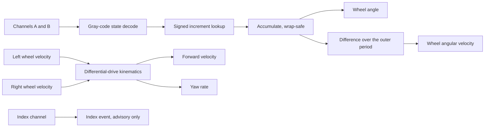

| Field     | Value                                  |
|-----------|----------------------------------------|
| Title     | Quadrature Decoding and Wheel Odometry |
| Type      | theory                                 |
| Status    | draft                                  |
| Version   | 0.1.0                                  |
| Component | motion-actuation                       |
| Date      | 2026-09-16                             |

> How two square waves per wheel become the chassis velocity and yaw rate the controller
> closes its outer loops on — and why the way velocity is derived from them matters more
> than it appears.

---

## Overview

Each wheel carries an incremental encoder producing two square waves in quadrature plus a
once-per-revolution index. Quadrature encoding is what makes the signal *directional*: one
channel alone gives speed but not sign, whereas the phase relationship between two channels
90° apart reveals which way the shaft is turning.

From those counts the robot must recover wheel angle, wheel velocity, and then the chassis
forward velocity and yaw rate that the outer control loops regulate. The main results are
the differential-drive kinematics

$$
v = \frac{r}{2}\left(\omega_L + \omega_R\right), \qquad \dot{\psi} = \frac{r}{b}\left(\omega_R - \omega_L\right)
$$

and the quantisation bound that governs how velocity may be computed from position,

$$
\sigma_\omega = \frac{2\pi}{N_{\text{eff}}\,\Delta t}
$$

That second result is the practical one: at a 500 Hz control rate, naive differencing of a
modest encoder produces velocity noise large enough to matter, and the way this is resolved
constrains the whole odometry design.

---

## Prerequisites

Quadrature signal encoding, modular arithmetic for counter wrap-around, finite differences,
uniform quantisation noise, and differential-drive kinematics.

| Symbol | Meaning | Unit |
|--------|---------|------|
| $A,\ B$ | Encoder quadrature channels, 90° apart | — |
| $Z$ | Index channel, one pulse per revolution | — |
| $N_{\text{line}}$ | Encoder lines per revolution | counts |
| $N_{\text{eff}}$ | Effective counts per revolution after decoding | counts |
| $c$ | Accumulated signed encoder count | counts |
| $\phi$ | Wheel angular position | rad |
| $\omega_L,\ \omega_R$ | Left and right wheel angular velocity | rad/s |
| $v$ | Chassis forward velocity | m/s |
| $\dot{\psi}$ | Chassis yaw rate | rad/s |
| $r$ | Wheel radius | m |
| $b$ | Track width between contact patches | m |
| $\Delta t$ | Sampling interval | s |
| $G$ | Gear ratio, motor to wheel | — |
| $C_{\max}$ | Hardware counter modulus | counts |
| $\sigma_\omega$ | Velocity quantisation noise | rad/s |

---

## Mathematical Foundation

### Model / Setup

The two channels are square waves in quadrature:

$$
A(t) = \operatorname{sgn}\sin\!\left(N_{\text{line}}\phi\right), \qquad
B(t) = \operatorname{sgn}\sin\!\left(N_{\text{line}}\phi - \tfrac{\pi}{2}\right)
$$

Together they form a two-bit Gray code — exactly one bit changes per transition — cycling
through 00, 01, 11, 10 in one rotational direction and the reverse in the other:

```
        ┌───┐   ┌───┐   ┌───┐
   A  ──┘   └───┘   └───┘   └──
          ┌───┐   ┌───┐   ┌───┐
   B  ────┘   └───┘   └───┘   └
        │ │ │ │
        └─┴─┴─┴── four decoded edges per line period
   forward: 00 → 01 → 11 → 10 → 00
   reverse: 00 → 10 → 11 → 01 → 00
```

The Gray-code property is what makes decoding robust: any transition changing *both* bits at
once is impossible and therefore detectable as an error, whether from noise or from missed
edges at excessive speed.

### Derivation

**Step 1 — Four-times decoding.** Counting every edge on both channels rather than only
rising edges on one multiplies resolution fourfold:

$$
N_{\text{eff}} = 4 N_{\text{line}}
$$

This is free resolution — no extra hardware, just counting all four transitions — and it
directly reduces the quantisation noise derived in Step 5, which is why it is specified.

**Step 2 — Direction.** The current and previous channel states together determine the
increment. Writing the state as $s = 2A + B$, the increment is a lookup on $(s_{k-1}, s_k)$:

| Previous → current | 00 | 01 | 11 | 10 |
|---|---|---|---|---|
| **00** | 0 | +1 | ✗ | −1 |
| **01** | −1 | 0 | +1 | ✗ |
| **11** | ✗ | −1 | 0 | +1 |
| **10** | +1 | ✗ | −1 | 0 |

The ✗ entries are the impossible double-bit transitions. They indicate that edges were missed
— the wheel is turning faster than the decoder can follow — and must be treated as an error
rather than guessed at, since guessing produces silently wrong odometry.

**Step 3 — Position.** Accumulating increments gives the count, and hence

$$
\phi = \frac{2\pi c}{N_{\text{eff}}\,G}
$$

where $G$ accounts for gearing between the encoder and the wheel when the encoder is mounted
on the motor shaft.

**Step 4 — Counter wrap.** A hardware counter of modulus $C_{\max}$ wraps. Reconstructing the
true increment requires interpreting the difference as a signed modular quantity:

$$
\Delta c_k = \left(\left(c_k - c_{k-1} + \tfrac{C_{\max}}{2}\right) \bmod C_{\max}\right) - \frac{C_{\max}}{2}
$$

This recovers the correct signed increment provided the wheel moves less than half a counter
period per sample — a bound that holds by an enormous margin at 500 Hz, but which is the
assumption that makes the reconstruction valid at all.

**Step 5 — Velocity and its quantisation noise.** The obvious estimator is a first difference:

$$
\hat{\omega}_k = \frac{2\pi\,\Delta c_k}{N_{\text{eff}}\,G\,\Delta t}
$$

But $\Delta c_k$ is an *integer*. At a short $\Delta t$ the true displacement falls between
counts, and the estimate can only take discrete values spaced

$$
\sigma_\omega = \frac{2\pi}{N_{\text{eff}}\,G\,\Delta t}
$$

apart. The interval $\Delta t$ is in the denominator, so **sampling faster makes velocity
noisier**, which is the central and counter-intuitive tension of this component: the control
loop wants a fast update, and the fast update is what degrades the measurement.

**Step 6 — Resolving the tension.** Three options, with different costs:

- *Difference over a longer interval* — divide by $M\Delta t$, reducing noise by $M$ at the
  cost of $M\Delta t/2$ of lag. Lag in a feedback path consumes phase margin, so this trades
  a measurement problem for a stability problem.
- *Low-pass the differenced velocity* — a first-order filter with time constant $\tau_f$
  reduces noise by roughly $\sqrt{2\tau_f/\Delta t}$ while adding $\tau_f$ of lag. Smoother
  trade-off, same currency.
- *Measure elapsed time between edges* rather than counts per interval. Noise then depends on
  timer resolution rather than encoder resolution, which is excellent at low speed — but it
  degrades at high speed and requires a fallback, making it the most complex option.

The saving grace is that velocity feeds the **outer** loop at 50 Hz, not the inner pitch loop
at 500 Hz. Differencing over the outer period directly gives a tenfold noise reduction with
lag that the slower loop tolerates comfortably. The inner loop depends on the gyroscope, not
on odometry, so encoder noise never reaches the fast path.

**Step 7 — Differential-drive kinematics.** Under rolling without slipping, each wheel's
contact point moves at $r\omega$. The chassis forward velocity is the mean and the yaw rate
comes from the difference over the track width:

$$
v = \frac{r}{2}\left(\omega_L + \omega_R\right), \qquad
\dot{\psi} = \frac{r}{b}\left(\omega_R - \omega_L\right)
$$

These are the two quantities the outer loops regulate. Note the asymmetry in error
sensitivity: $v$ averages the two wheels, so independent noise partially cancels, whereas
$\dot{\psi}$ differences them, so noise adds — and it is then divided by the small track width
$b$, amplifying it further. **Yaw rate from odometry is intrinsically the noisier of the
two.**

**Step 8 — The index channel.** The index pulse marks one absolute shaft position per
revolution and is useful for diagnostics and for detecting accumulated miscounts. It is
deliberately *not* used to correct the incremental count: a spurious index pulse from
electrical noise would teleport the odometry, turning a transient disturbance into a
permanent error. Advisory only.

### Key Results

$$
\begin{aligned}
N_{\text{eff}} &= 4N_{\text{line}} && \text{(four-times decoding)}\\[2mm]
\phi &= \frac{2\pi c}{N_{\text{eff}}\,G} && \text{(wheel angle)}\\[2mm]
\Delta c_k &= \left(\left(c_k - c_{k-1} + \tfrac{C_{\max}}{2}\right)\bmod C_{\max}\right) - \tfrac{C_{\max}}{2} && \text{(wrap-safe increment)}\\[2mm]
\sigma_\omega &= \frac{2\pi}{N_{\text{eff}}\,G\,\Delta t} && \text{(velocity quantisation)}\\[2mm]
v &= \frac{r}{2}(\omega_L + \omega_R), \qquad \dot{\psi} = \frac{r}{b}(\omega_R - \omega_L) && \text{(differential drive)}
\end{aligned}
$$

---

## Block Diagrams



Geometry, viewed from above:

```
        ω_L                    ω_R
         │                      │
     ┌───┴───┐              ┌───┴───┐
     │ wheel │◄──────b──────►│ wheel │
     └───────┘              └───────┘
              ──────► v = r(ω_L + ω_R)/2
              ↻  ψ̇ = r(ω_R − ω_L)/b
```

---

## Numerical Properties

| Property   | Value / Condition |
|------------|-------------------|
| Complexity | Decoding is a table lookup per edge. Per control iteration: one modular subtraction, one multiply and a small filter per wheel — negligible against a 500 Hz budget |
| Precision | Position is exact in integer counts, with no accumulated rounding. Velocity is quantised at $\sigma_\omega$ and is the only lossy step |
| Stability | Position accumulation is exact and drift-free. Velocity estimation is unconditionally stable; filtering adds a single well-behaved pole |
| Range | Bounded above by the maximum decodable edge rate $N_{\text{eff}}\,G\,\omega_{\max}/2\pi$; beyond it edges are missed and the impossible-transition check fires |

**Sensitivities.** The dominant sensitivity is to $N_{\text{eff}}\Delta t$, the product that
sets velocity noise. Encoder resolution and differencing interval are interchangeable in this
respect — a coarse encoder differenced over a long interval performs identically to a fine
one differenced quickly, but the two choices have very different lag, which is why the
differencing interval is tied to the outer loop rather than the inner.

**Yaw rate is the weak link**, for the structural reason in Step 7: it differences the wheels
rather than averaging them, then divides by a small $b$. A narrow-track robot has intrinsically
noisy odometric yaw. If yaw performance proves inadequate, the gyroscope's yaw-axis rate is
the natural alternative — it is already being sampled and is far quieter, at the cost of the
bias handling covered in `attitude-estimation.md`.

Geometric parameters enter as **scale errors, not noise**: an error in $r$ scales all
velocities proportionally, and an error in $b$ scales yaw rate. Both are systematic and
therefore calibratable, unlike quantisation.

The unmodelled error that dominates in practice is **wheel slip**. Odometry measures wheel
rotation, not ground travel; a slipping wheel reports motion that did not occur, and nothing
in the signal distinguishes the two. On a balancing robot, aggressive correction is exactly
when slip is most likely and when trustworthy odometry matters most.

---

## Worked Example

A 400-line encoder on the motor shaft, gear ratio $G = 30$, wheel radius $r = 0.034$ m, track
width $b = 0.15$ m.

$$
N_{\text{eff}} = 4 \times 400 = 1600\ \text{counts per motor revolution}
$$

Counts per wheel revolution are $1600 \times 30 = 48{,}000$, so wheel angular resolution is

$$
\frac{2\pi}{48{,}000} \approx 1.3\times10^{-4}\ \text{rad} \approx 0.0075^{\circ}
$$

corresponding to $r \times 1.3\times10^{-4} \approx 4.4\ \mu\text{m}$ of ground travel —
position resolution is not a concern.

Velocity differenced at the **inner** loop rate ($\Delta t = 2$ ms):

$$
\sigma_\omega = \frac{2\pi}{48{,}000 \times 0.002} \approx 0.065\ \text{rad/s}
\quad\Rightarrow\quad \sigma_v = r\sigma_\omega \approx 2.2\ \text{mm/s}
$$

Differenced at the **outer** loop rate ($\Delta t = 20$ ms):

$$
\sigma_\omega \approx 0.0065\ \text{rad/s} \quad\Rightarrow\quad \sigma_v \approx 0.22\ \text{mm/s}
$$

Against a 0.3 m/s commanded velocity, 0.22 mm/s is under 0.1% — entirely adequate. This is
the calculation behind tying velocity differencing to the 50 Hz outer loop.

Yaw rate at the outer rate, with independent per-wheel noise adding in quadrature:

$$
\sigma_{\dot\psi} = \frac{r\sqrt{2}\,\sigma_\omega}{b}
= \frac{0.034 \times 1.414 \times 0.0065}{0.15} \approx 0.0021\ \text{rad/s}
$$

about 0.12°/s — acceptable against a 45°/s command, and visibly the noisier channel exactly
as Step 7 predicts.

Maximum decodable speed at a peak wheel speed of 105 rad/s (motor 3150 rad/s):

$$
\frac{1600 \times 3150}{2\pi} \approx 802{,}000\ \text{edges/s}
$$

which is well beyond software edge counting and firmly in hardware-timer territory —
supporting the open question recorded in the actuation design.

---

## Limitations & Assumptions

- **Assumes**: rolling without slipping, so wheel rotation equals ground travel. This is the
  assumption most often violated in practice, and nothing in the measurement reveals when it
  fails.
- **Assumes**: rigid wheels of known, constant radius. Compliant tyres change effective radius
  with load, appearing as a slowly varying scale error.
- **Assumes**: wheel displacement per sample is under half a counter period, making the
  modular reconstruction unambiguous.
- **Assumes**: the edge rate stays within the decoder's capability at maximum wheel speed.
- **Assumes**: quadrature channels are clean. Electrical noise on a channel produces spurious
  edge pairs; the impossible-transition check catches gross corruption but not every case.
- **Does not handle**: absolute wheel position. Counts are relative to power-on, and the index
  is advisory only.
- **Does not handle**: lateral motion. Differential-drive kinematics assume the contact points
  move along the wheel plane; sideways skidding is invisible.
- **Does not handle**: uneven ground. All results assume both contact patches stay on a flat
  plane.
- **Does not handle**: backlash. With the encoder on the motor shaft, gear backlash appears as
  motor motion that the wheel does not follow — a direct error on every reversal.

---

## References

1. National Instruments. *Encoder Measurements: How-To Guide* — quadrature decoding modes and
   the resolution they yield.
2. Borenstein, J., Everett, H. R. and Feng, L. *Where am I? Sensors and Methods for Mobile
   Robot Positioning*. University of Michigan, 1996 — odometry error modelling and calibration.
3. Siegwart, R., Nourbakhsh, I. R. and Scaramuzza, D. *Introduction to Autonomous Mobile
   Robots*, 2nd ed. — differential-drive kinematics.
4. Merry, R., van de Molengraft, M. and Steinbuch, M. "Velocity and Acceleration Estimation
   for Optical Incremental Encoders." *Mechatronics*, 20(1), 2010 — the noise-versus-lag
   trade-off of Step 6.
